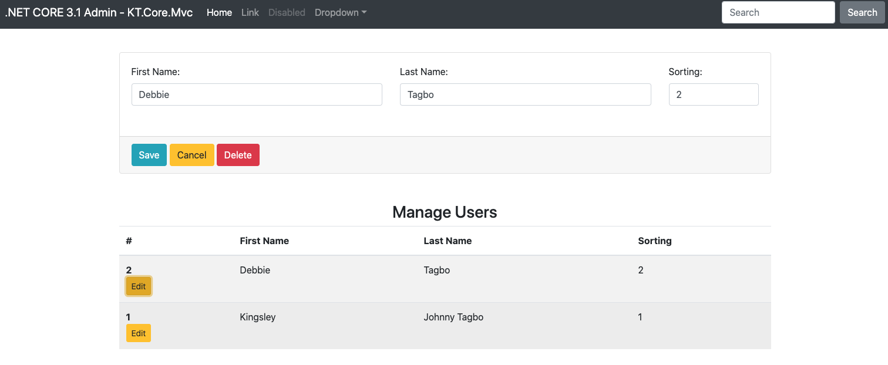
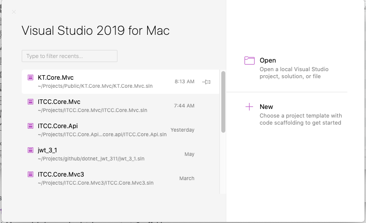
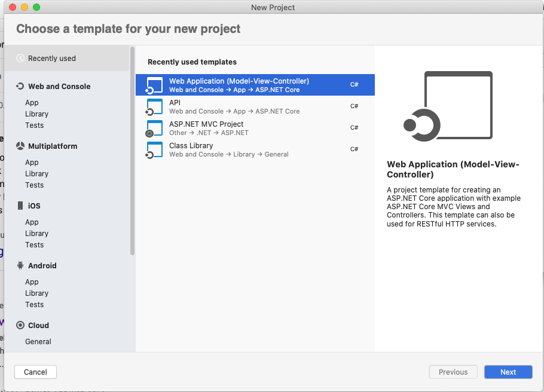
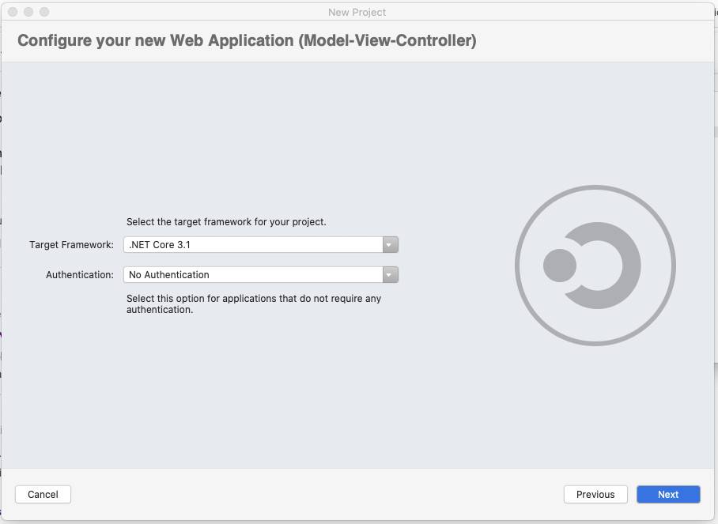
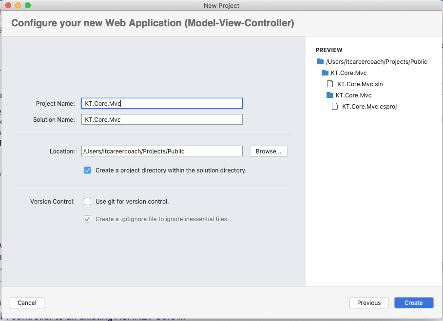
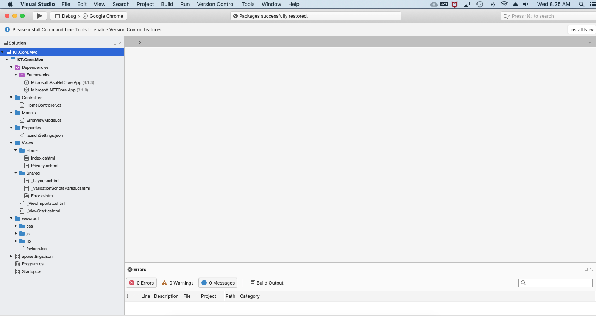

### Download Minified & Compiled Bootstrap 4.5
https://getbootstrap.com/docs/4.5/getting-started/download/
=======
# How To Build Your Website in ASP.NET CORE (3.1) MVC\

## STEPS - CRUD

### Step 1

## STEPS - SETUP

### Step 1

### Step 2

### Step 3

### Step 4

### Step 5

## GIT COMMANDS

### git init
### git add --all
### git commit -am "asp.net mvc core launch project"
### git remote add origin https://github.com/kingsleytagbo/dotnet-core-mvc-3.git
### git pull https://github.com/kingsleytagbo/dotnet-core-mvc-3.git --allow-unrelated-histories
### git push --set-upstream origin master
### git push origin master 